# Báo cáo cá nhân — K4-L3B Day 13 Monitoring & LLMOps

> Mỗi học viên hoàn thiện một file duy nhất này. Khi dẫn evidence, dùng đường dẫn tương đối, ví dụ `evidence/07-trace-waterfall.png`.

## 1. Thông tin học viên

- **Họ và tên:** Nguyễn Công Thịnh
- **MSSV:** 2A202602781
- **Lớp:** K4-L3B
- **Repository URL:** https://github.com/2003congthinh/K4-L3-DAY13-NguyenCongThinh-2A202602781-Monitoring-LLMOps
- **Commit SHA cuối:** fdf9f5ce64635f3442f7f8344a63c0c1e21e5bc8
- **Challenge ID:** `day13-k4-l3b-monitoring-llmops-v1` (cohort K4)
- **Tên project Langfuse cá nhân:** `day13-k4-l3b-2A202602781` (Langfuse Cloud US — `us.cloud.langfuse.com`)

## 2. Evidence index

| Evidence | Đường dẫn |
|---|---|
| Pytest cuối | 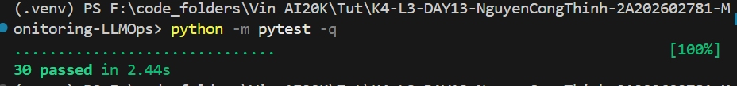 |
| Log validator | 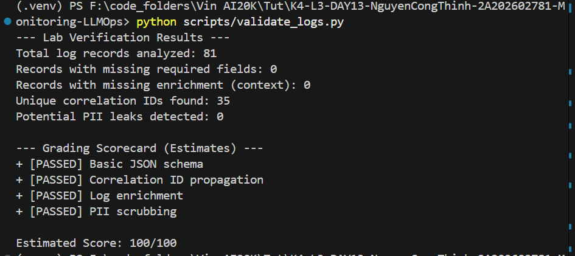 |
| Dashboard validator | 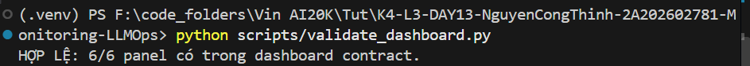 |
| Structured log | 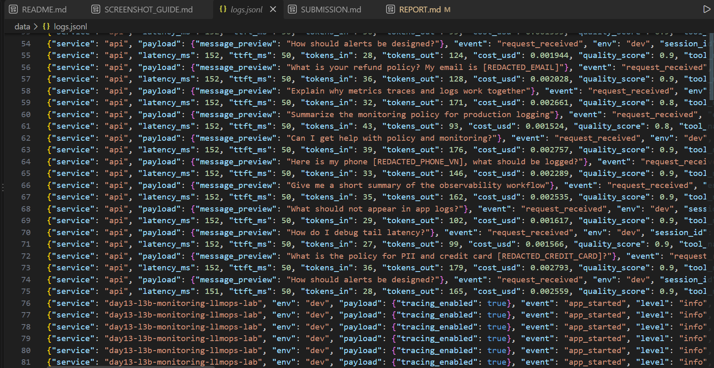, 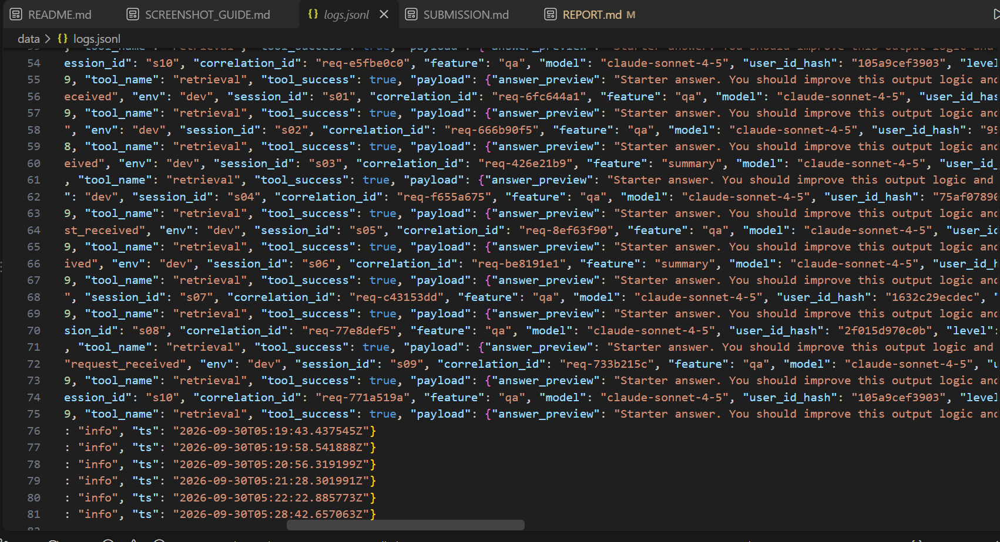, 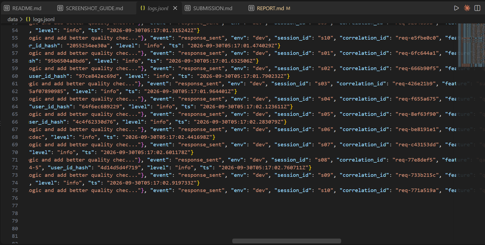, 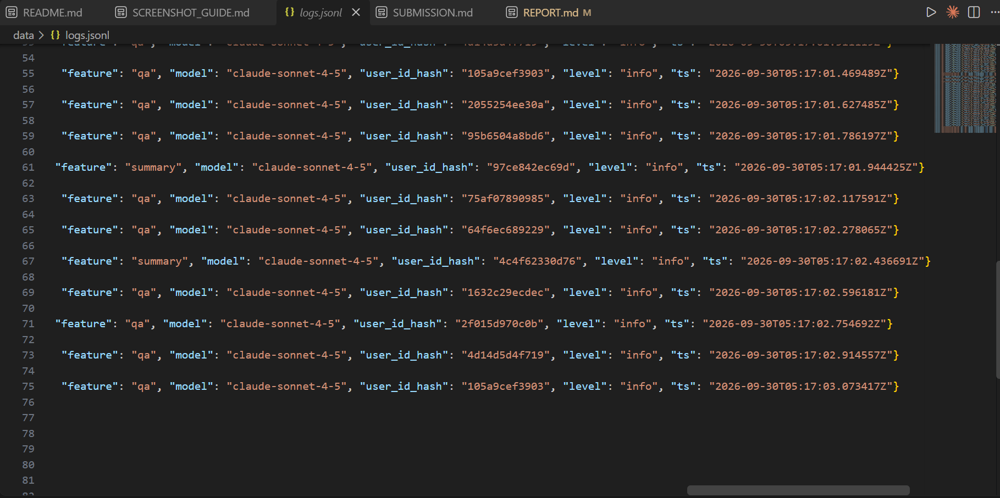 |
| PII redaction | 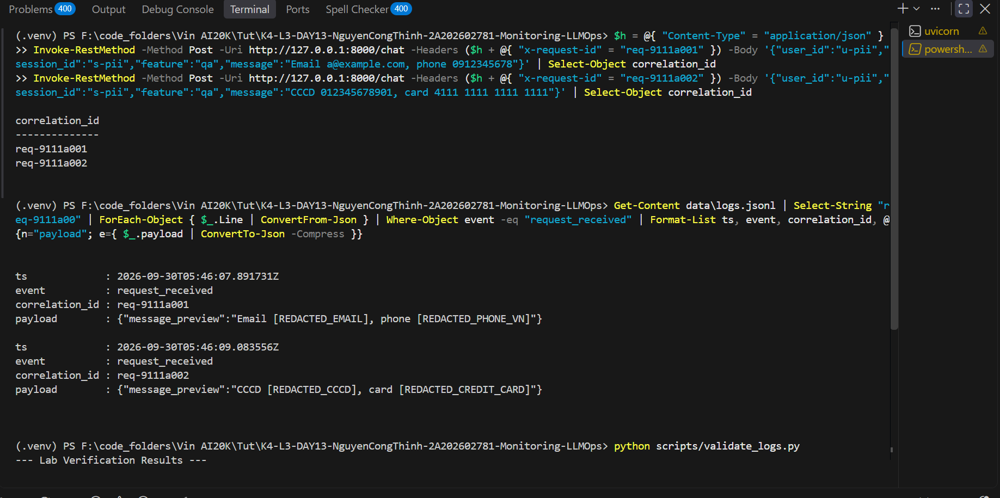, 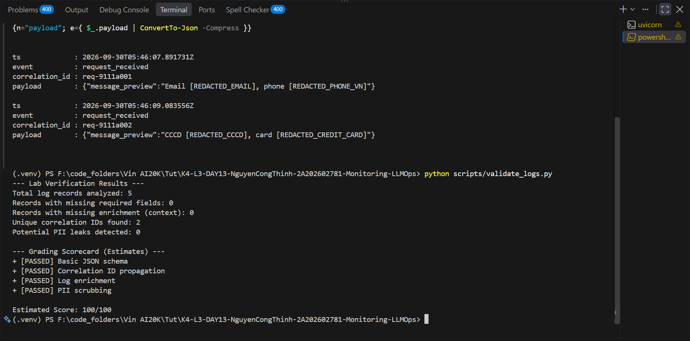 |
| Trace list | 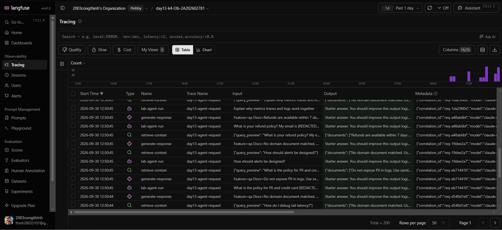 |
| Trace waterfall | 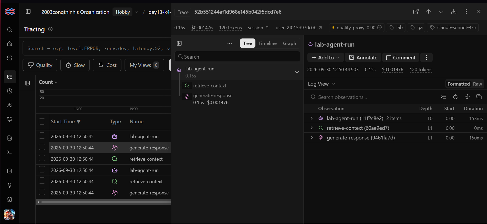 |
| Trace metadata | 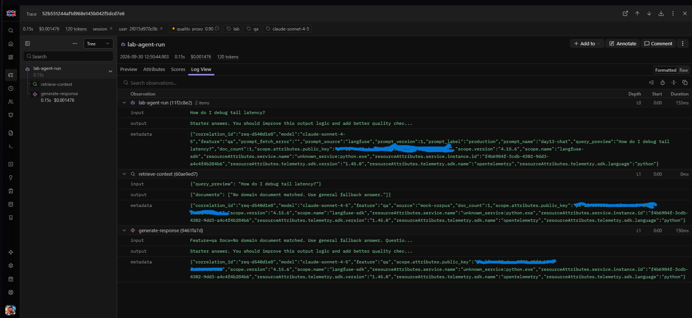 |
| Prompt versions | 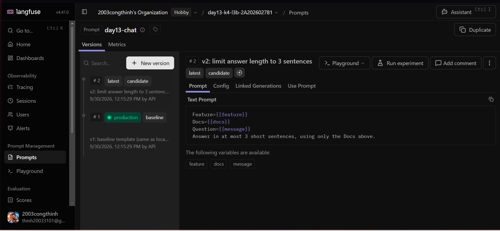 |
| Prompt rollback | 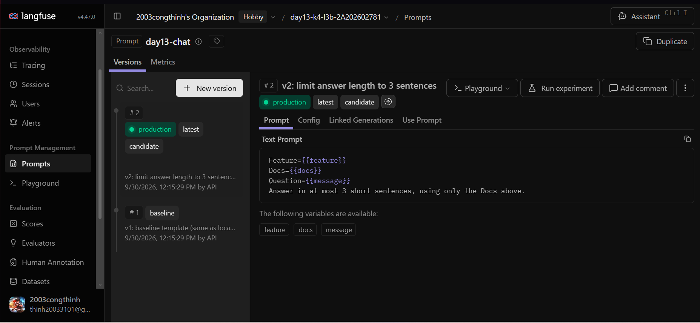, 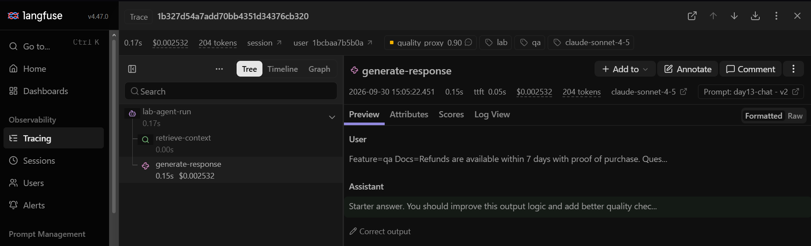, 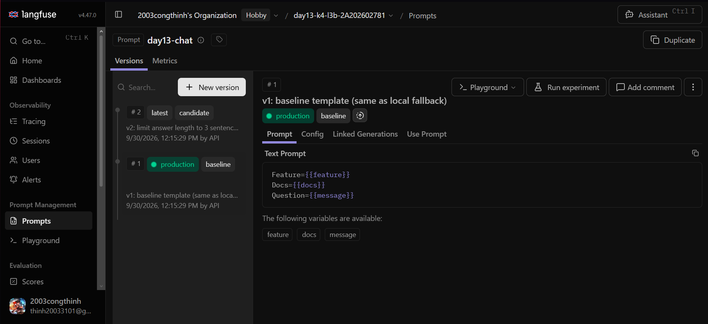, 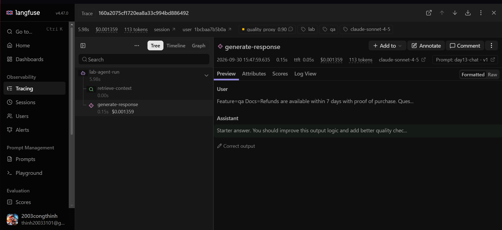 |
| Dashboard runtime | 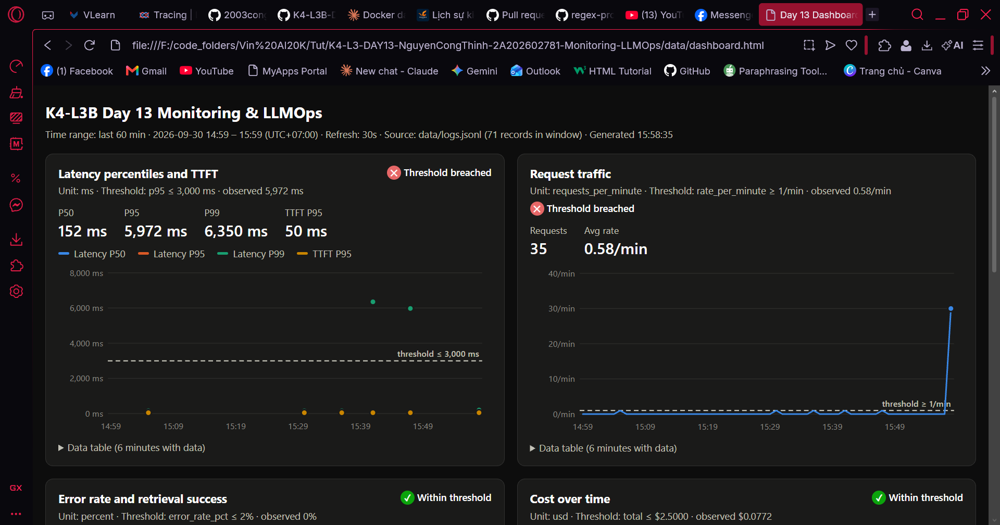, 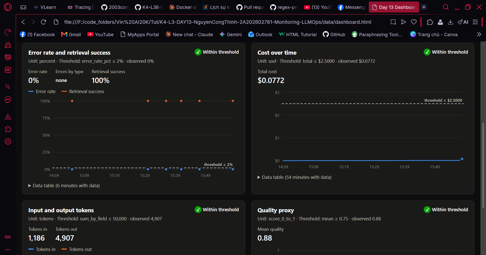, 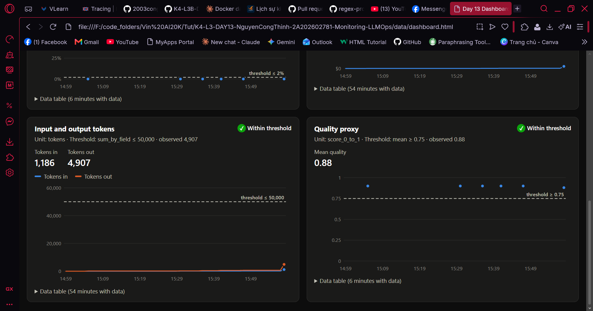 |
| Incident metric | 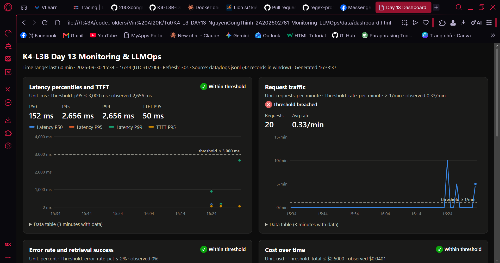 |
| Incident log | 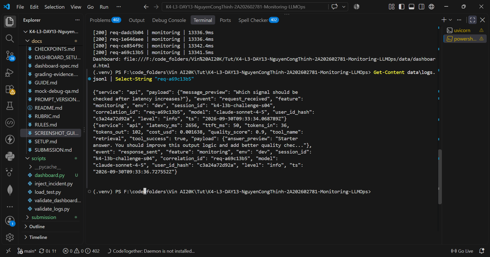 |
| Incident trace | 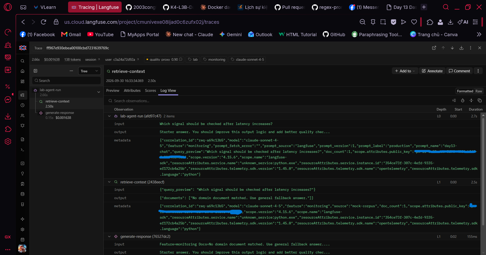 |

## 3. Kết quả kỹ thuật

| Nội dung | Baseline | Kết quả cuối | Nhận xét |
|---|---|---|---|
| `validate_logs.py` | 80/100 — log chỉ có 13 dòng `app_started`, 0 correlation ID (con số 80 chưa phản ánh thật vì chưa có request nào) | **100/100** — 42 records, 21 correlation ID, 0 PII leak | Sau CP1, mỗi request có ID riêng và đủ context |
| `validate_dashboard.py` | 6/6 | **6/6** | Contract có sẵn; phần thêm mới là dashboard runtime (`scripts/dashboard.py`) |
| `pytest` | 22 passed | **30 passed** | +8 test: PII (CCCD, thẻ, passport, địa chỉ), trace masking, 3 test tính toán dashboard |
| Số traces hợp lệ | 0 — trace chỉ có root, `correlation_id=MISSING`, prompt `local-fallback` | **133** traces có correlation ID thật (123 lấy prompt từ Langfuse), mỗi trace có root → retrieval + generation | ≥ 10 theo yêu cầu |
| Số PII leak | Chưa đo được (log baseline chưa có request) | **0** | Kiểm bằng `validate_logs.py` + request chứa PII giả |
| Latency P95 / TTFT P95 | 1,936 ms / 50 ms (35 request đầu, P95 bị kéo lên bởi cold start fetch prompt) | 895 ms / 50 ms (traffic bình thường); **2,656 ms / 50 ms khi có incident** | TTFT không đổi trong incident → chậm nằm trước bước LLM |
| Retrieval success rate | 100% | 100% | Kể cả khi incident: retrieval chậm chứ không lỗi |

## 4. Logging và PII

- **Cách tạo/nhận và truyền correlation ID:** `CorrelationIdMiddleware` ([app/middleware.py](../app/middleware.py)) gọi `clear_contextvars()` đầu mỗi request để không rò context giữa các request, lấy header `x-request-id` nếu client gửi, nếu không thì sinh `req-<8 hex>` từ `uuid4`. ID được `bind_contextvars` (mọi log sau đó tự có `correlation_id`), gán vào `request.state` để agent đưa vào trace metadata, và trả lại qua header `x-request-id` cùng `x-response-time-ms`.
- **Các metadata được ghi vào structured log:** `ts`, `level`, `service`, `event`, `correlation_id`; context request `user_id_hash` (SHA-256, 12 ký tự, không log user_id thô), `session_id`, `feature`, `model`, `env` được bind trong `/chat` trước log `request_received`; `response_sent` thêm `latency_ms`, `ttft_ms`, `tokens_in`, `tokens_out`, `cost_usd`, `quality_score`, `tool_name`, `tool_success`; `request_failed` thêm `error_type`.
- **Cách bảo đảm PII được scrub trước khi ghi:** processor `scrub_event` được đăng ký trong structlog **trước** `JsonlFileProcessor` và `JSONRenderer` ([app/logging_config.py](../app/logging_config.py)), nên dữ liệu bị che trước khi serialize/ghi file. Pattern trong [app/pii.py](../app/pii.py): email, điện thoại VN (0/+84, có dấu cách/chấm/gạch), CCCD 12 số, thẻ 16 số, passport, địa chỉ (từ khóa phường/quận/…). Log chỉ chứa preview đã scrub (`summarize_text`, 80 ký tự). Trace Langfuse có thêm lớp bảo vệ: hook `mask_pii` ([app/tracing.py](../app/tracing.py)) scrub mọi input/output/metadata trước khi export.
- **Cách kiểm chứng kết quả:** `pytest` cho từng loại PII ([tests/test_pii.py](../tests/test_pii.py)); gửi request chứa email/SĐT/CCCD/thẻ giả và đối chiếu log (evidence 05: `[REDACTED_EMAIL]`, `[REDACTED_PHONE_VN]`, `[REDACTED_CCCD]`, `[REDACTED_CREDIT_CARD]`); `validate_logs.py` quét toàn bộ file bằng detector độc lập → 0 leak.

## 5. Tracing và prompt versioning

- **Cách xác nhận traces do chính tôi tạo trong project cá nhân:** trace nằm trong project `day13-k4-l3b-2A202602781`; key trong `.env` thuộc project này; thời gian trace khớp lúc chạy `load_test.py`, và `correlation_id` trong trace metadata khớp ID in ra terminal và ID trong `data/logs.jsonl`.
- **Cấu trúc root/retrieval/generation observations:** trace `day13-agent-request` → root `lab-agent-run` (type `agent`; input/output là preview đã scrub; metadata prompt name/label/version/source) → hai con cùng cấp: `retrieve-context` (type `retriever`; input query preview, output danh sách documents) và `generate-response` (type `generation`; model `claude-sonnet-4-5`, usage input/output tokens, cost input/output, `completion_start_time` → TTFT, link tới prompt Langfuse). Trace có `user_id` (đã hash), `session_id`, tags, environment `dev` và score `quality_proxy`. Code: [app/agent.py](../app/agent.py).
- **Cách nối trace với log:** cùng một `correlation_id`. Ví dụ evidence 08: trace `52b551244af1d968e145b042f5dcd7e6` có metadata `correlation_id=req-d540d1e8`, trùng với log line cùng ID trong `data/logs.jsonl`.
- **Prompt name:** `day13-chat` (text prompt, 3 biến `{{feature}}`, `{{docs}}`, `{{message}}`)
- **Version/label baseline:** v1 — labels `baseline` (+ `production` ban đầu); template giống prompt local
- **Version/label candidate:** v2 — label `candidate`; thêm dòng "Answer in at most 3 short sentences, using only the Docs above."
- **Trace ID của mỗi version:**

  | Label → version | correlation_id | Trace ID |
  |---|---|---|
  | `baseline` → v1 | `req-b1a5e001` | `4aaf049b80bf7ad32559bba2079dc4c3` |
  | `candidate` → v2 | `req-ca9d1d02` | `35bc0769fc8d781f3e53b8071f395258` |
  | `production` → v2 (sau promote) | `req-10a00002` | `1b327d54a7add70bb4351d34376cb320` |
  | `production` → v1 (sau rollback) | `req-10b00001` | `160a2075cf1720ea8a33c994bd886492` |

- **Cách promote và rollback `production`:** đổi label trên Langfuse UI — promote: gắn `production` cho v2 (evidence 10a), request tiếp theo dùng v2 (10b); rollback: gắn lại `production` cho v1 (10c), request tiếp theo dùng v1 (10d). Không sửa code, không restart: app gọi `get_prompt(name, label=...)`, label trỏ version nào thì Langfuse trả version đó; thay đổi có hiệu lực sau khi cache 60 giây hết hạn.

## 6. Dashboard, SLO và alerts

- **Dashboard và sáu panel:** [scripts/dashboard.py](../scripts/dashboard.py) đọc `data/logs.jsonl`, tính 6 panel đúng contract [config/dashboard.yaml](../config/dashboard.yaml) và xuất `data/dashboard.html` (time range 60 phút, refresh 30 giây, đơn vị, threshold line, trạng thái đạt/vượt ngưỡng, bảng dữ liệu theo phút). Panel: (1) latency P50/P95/P99 + TTFT P95 (ms, P95 ≤ 3000), (2) traffic request/phút (≥ 1), (3) error rate + breakdown `error_type` + retrieval success (%, error ≤ 2), (4) cost cộng dồn (USD, ≤ 2.5), (5) tokens in/out cộng dồn (≤ 50,000), (6) quality proxy trung bình (≥ 0.75). Công thức có test: [tests/test_dashboard_runtime.py](../tests/test_dashboard_runtime.py).
- **SLO và lý do chọn:** [config/slo.yaml](../config/slo.yaml) — 99.5% request `response_sent` với `latency_ms ≤ 3000` trong 28 ngày. Giữ ngưỡng 3000 ms vì baseline bình thường 150–450 ms, cold start fetch prompt ~2 s vẫn nằm dưới ngưỡng (tránh báo động giả) nhưng một sự cố retrieval +2.5 s sẽ đẩy request sát/vượt ngưỡng.
- **Cách tính error budget:** error budget = 100% − 99.5% = 0.5% số request trong cửa sổ 28 ngày. Với 10,000 request → tối đa 50 request được phép lỗi (`request_failed`) hoặc chậm hơn 3000 ms. Workload lab nhỏ (vài chục request) nên chỉ một request xấu đã vượt budget — vì vậy alert dùng điều kiện theo tỉ lệ trong 5–10 phút thay vì đếm tuyệt đối.
- **Ba alert và runbook tương ứng:** [config/alert_rules.yaml](../config/alert_rules.yaml), runbook trong [docs/alerts.md](../docs/alerts.md); kênh Slack `#k4-l3b-alerts`, owner `student-2A202602781`.

  | Alert | Severity | Điều kiện | Duration | Runbook |
  |---|---|---|---|---|
  | `HighLatencyP95` | warning | P95 `latency_ms` > 3000 ms | 5m | [Alert 1](../docs/alerts.md#alert-1) |
  | `HighErrorRateOrRetrievalFailing` | critical | error rate > 2% hoặc retrieval success < 90% | 5m | [Alert 2](../docs/alerts.md#alert-2) |
  | `CostPerRequestSpike` | warning | cost trung bình > 0.005 USD/request hoặc > 2.5 USD/ngày | 10m | [Alert 3](../docs/alerts.md#alert-3) |

## 7. Điều tra challenge

- **Challenge ID:** `day13-k4-l3b-monitoring-llmops-v1` (cohort K4)
- **Khoảng thời gian điều tra:** lần điều tra đầu 16:04:58–16:05:14 (UTC+07, tức 09:04:58–09:05:14 UTC); chạy lại challenge để lấy evidence lúc ~16:33 (09:33 UTC) — evidence 12–14 thuộc lần chạy này.
- **Triệu chứng từ metrics:** panel Latency (evidence 12): P50 152 ms và P95/P99 **2,656 ms** so với baseline ~150–190 ms cùng concurrency (~14–17 lần). TTFT P95 giữ 50 ms; error rate 0%, retrieval success 100%, tokens/cost mỗi request bình thường → sự cố thuần latency, nằm trước bước LLM sinh token. Phía client mỗi request mất ~13.3 s.
- **Log line và correlation ID liên quan:** evidence 13 — `response_sent`, `correlation_id=req-a69c13b5`, `feature=monitoring`, `session_id=k4-l3b-challenge-s04`, `latency_ms=2656`, `ttft_ms=50`, `tool_name=retrieval`, `tool_success=true`, `ts=2026-09-30T09:33:36.727Z`. Cả 5 request challenge đều `latency_ms` ≈ 2,653–2,656.
- **Trace ID và span gây ảnh hưởng:** trace `ff967e930ebea00100cbd7231639769c` (cùng `correlation_id=req-a69c13b5`, evidence 14): `lab-agent-run` 2.66 s, trong đó **`retrieve-context` 2.50 s (~94%)**, `generate-response` 0.15 s (bình thường, TTFT 0.05 s), prompt vẫn `day13-chat` v1. So sánh trace bình thường: `retrieve-context` ~0.001 s.
- **Root cause:** bước retrieval (RAG/vector store lookup) bị chậm thêm ~2.5 s mỗi lần gọi. LLM, prompt version, error và token đều không đổi nên loại trừ nguyên nhân từ model, prompt hay cost.
- **Fix action:** khôi phục retrieval về trạng thái bình thường (tắt incident bằng `python scripts/inject_incident.py --disable`), sau đó chạy lại **cùng** challenge queries để xác minh: latency về ~152 ms/request (ví dụ `req-ec2ac8de`).
- **Preventive measure:**
  1. Thêm alert theo từng bước: P95 thời lượng span `retrieve-context` > 500 ms trong 5 phút — alert end-to-end hiện tại (P95 > 3000 ms) **không kích hoạt** vì 2,656 ms < 3,000 ms dù người dùng chờ ~13 s.
  2. Đặt timeout cho retrieval (ví dụ 1 s) và trả fallback document khi quá hạn, để dependency chậm không kéo cả request.
  3. Ghi latency end-to-end (header `x-response-time-ms` vào log) và làm endpoint `/chat` không chặn event loop (agent đồng bộ đang chạy trong `async def`, nên 5 request đồng thời bị xếp hàng: 5 × 2.65 s ≈ 13.3 s ở phía client, trong khi `latency_ms` chỉ đo thời gian trong agent).

## 8. Giải thích và tự đánh giá

- **Một quyết định kỹ thuật quan trọng và lý do:** Input/output của trace chỉ ghi **preview đã scrub** (`summarize_text`, tối đa 80 ký tự) thay vì toàn bộ prompt và câu trả lời, kèm hook `mask_pii` scrub mọi dữ liệu gửi lên Langfuse làm lớp bảo vệ thứ hai. Lý do: README yêu cầu không lưu raw prompt/output có thể chứa PII, và rubric không tính trace chứa PII thô; regex không thể bắt hết mọi dạng PII nên giới hạn độ dài giúp thu hẹp phạm vi rò rỉ nếu regex bỏ sót. Đánh đổi là trace có ít ngữ cảnh hơn để debug; bù lại, output của `retrieve-context` giữ đầy đủ documents (corpus không chứa PII) và generation được link tới đúng prompt version nên vẫn xem được template đã dùng.
- **Một lỗi/blocker đã gặp:** Sau khi làm CP1, mọi request `/chat` đều hỏng: `load_test.py` báo `Expecting value: line 1 column 1` và `WinError 10054`. Nguyên nhân gồm hai lỗi trong middleware — `request.headers["x-request-id"]` ném `KeyError` khi client không gửi header, và header `x-response-time-ms` được gán giá trị `float` (tính bằng giây) nên Starlette báo `'float' object has no attribute 'encode'`. Cùng lúc, pattern `address` trong `pii.py` kết thúc bằng `|` nên khớp chuỗi rỗng, chèn `[REDACTED_ADDRESS]` vào giữa mọi ký tự và làm hỏng cả tên event trong log.
- **Cách tìm nguyên nhân và xử lý:** Lỗi `Expecting value` cho thấy server trả về body không phải JSON (trang lỗi 500), nên vấn đề nằm ở server chứ không ở load test. Tái hiện request bằng `httpx.ASGITransport` với `raise_app_exceptions=True` để thấy traceback thật: không có header → `KeyError`; có header → lỗi `float`. Sửa bằng `request.headers.get("x-request-id")` và `str(int((time.perf_counter() - start) * 1000))` (đúng đơn vị ms, kiểu chuỗi). Log tái hiện lộ ra lỗi `[REDACTED_ADDRESS]`; sửa pattern thành `\b(?:thôn|xóm|phường|xã|quận|huyện)\s+\S+`. Sau đó xóa log cũ, chạy lại và kiểm chứng: `validate_logs.py` 100/100, header trả về đúng, không rò context giữa các request, thêm test cho CCCD và thẻ.
- **Cách hiểu luồng Metrics → Logs → Traces:** Metrics trả lời "có vấn đề gì và từ lúc nào" trên toàn hệ thống; logs trả lời "request cụ thể nào bị ảnh hưởng" nhờ `correlation_id`; trace trả lời "bước nào trong request đó gây ra". Trong challenge: panel Latency cho thấy P95 tăng từ ~190 ms lên 2,656 ms nhưng TTFT, error và token không đổi → khoanh vùng là sự cố latency trước bước LLM; lọc log lấy `req-a69c13b5` có `latency_ms=2656`; trace cùng ID cho thấy `retrieve-context` chiếm 2.50 s/2.66 s. Mỗi lớp thu hẹp phạm vi cho lớp sau, và kết luận chỉ đáng tin khi cả ba cùng chỉ về một nguyên nhân.
- **Vai trò của prompt version, token/cost, SLO hoặc rollback trong vận hành LLM:** Prompt version gắn trên từng trace giúp khẳng định hoặc loại trừ prompt khi điều tra — trong incident, trace vẫn dùng `day13-chat` v1 nên loại được giả thuyết "prompt mới gây chậm". Rollback chỉ là chuyển label `production` trên Langfuse, không cần sửa code hay deploy lại, có hiệu lực sau khi cache 60 s hết hạn. Token/cost ghi trên từng generation cho thấy tác động chi phí của thay đổi: v2 dài hơn làm input tokens tăng từ 28 lên 44 cho cùng câu hỏi. SLO và error budget biến "chậm/lỗi" thành ngưỡng có thể đo và quyết định khi nào phải hành động.
- **Điều quan trọng nhất đã học:** Chỗ đo quan trọng không kém con số đo được. Trong challenge, `latency_ms` trong log chỉ là 2,656 ms — dưới ngưỡng alert 3,000 ms — nhưng phía người dùng mỗi request mất ~13.3 s vì endpoint async gọi agent đồng bộ làm các request xếp hàng. Alert đã cấu hình sẽ **không** kích hoạt dù người dùng bị ảnh hưởng nặng. Tương tự, fallback prompt giữ API chạy khi mạng tới Langfuse chập chờn nhưng che đi lỗi, chỉ lộ ra qua `prompt_source=local-fallback`. Observability tốt cần đo end-to-end, đo theo từng bước, và theo dõi cả các cơ chế fallback.
- **Hạn chế hoặc phần chưa hoàn thành, nếu có:**
  - LLM là mock: câu trả lời luôn cố định và output tokens ngẫu nhiên, nên prompt v2 ("tối đa 3 câu") không thực sự làm câu trả lời ngắn lại; so sánh version chỉ thể hiện ở input tokens.
  - SLO/alert latency dựa trên `latency_ms` phía server nên bỏ sót thời gian xếp hàng; các biện pháp phòng ngừa ở mục 7 (alert theo span retrieval, timeout + fallback cho retrieval, endpoint không chặn event loop) mới là đề xuất, chưa triển khai.
  - Alert mới dừng ở cấu hình và runbook, chưa kết nối Slack thật; dashboard là HTML tĩnh sinh lại định kỳ (`--watch`) chứ không phải hệ thống real-time.
  - Panel Traffic báo vượt ngưỡng (< 1 request/phút) vì workload lab chạy theo đợt, không phải traffic liên tục.
  - Mạng tới Langfuse có lúc chập chờn (lỗi DNS, timeout), làm một số request dùng prompt fallback và một số span bị mất khi export; đã tăng `LANGFUSE_TIMEOUT=20` để giảm lỗi export.
  - Có sử dụng AI coding assistant (Claude Code) để hỗ trợ triển khai tracing, dashboard, gỡ lỗi và soạn báo cáo; kết quả đã được chạy và kiểm chứng trên project Langfuse và log của tôi.

## 9. Checklist trước khi nộp

- [x] Kết quả và evidence thuộc commit SHA cuối.
- [x] Tất cả ảnh/output mở được bằng đường dẫn tương đối.
- [x] Incident evidence nối đúng metric → log → trace.
- [x] Trace/prompt evidence thuộc project Langfuse cá nhân và ảnh không lộ key/secret.
- [x] Repository chạy lại được theo README.
- [x] Không có secret, API key, PII thô hoặc evidence của người khác/lớp khác.
- [x] URL repo và commit SHA cuối đã được nộp trên LMS/Codelabs.
